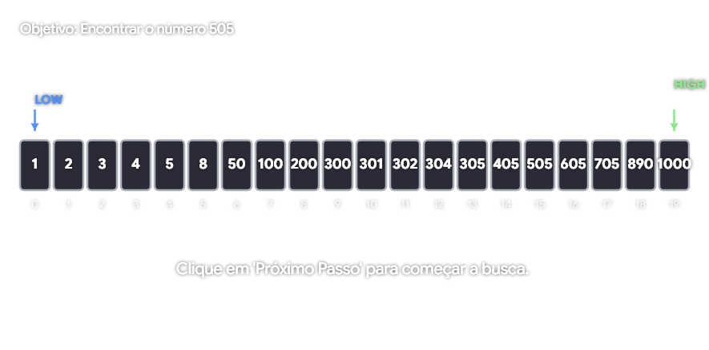

---

# Relatório de Performance: Algoritmo de Busca Binária / Performance Report: Binary Search Algorithm


### Visão Geral / Overview

Este documento detalha os resultados da análise de performance do algoritmo de busca binária implementado em Go, visando garantir eficiência algorítmica e baixo consumo de recursos.

This document details the performance analysis results of the binary search algorithm implemented in Go, aiming to ensure algorithmic efficiency and low resource consumption.

---

### Ambiente de Execução / Execution Environment

Os testes foram realizados em um sistema de desenvolvimento focado em performance:
The tests were conducted in a development system focused on performance:

* **OS/Arch:** Linux / amd64
* **CPU:** AMD Ryzen 7 5700U with Radeon Graphics
* **Go Version:** N/A (Standard Go Testing Framework)

---

### Resultados do Benchmark / Benchmark Results

```text
BenchmarkBinarySearch-16    97912288    12.48 ns/op    0 B/op    0 allocs/op

```

#### Análise dos Dados / Data Analysis

* **BenchmarkBinarySearch-16**: Indica que o teste foi executado utilizando o escalonamento multithread do Go (16 GOMAXPROCS).
* **97.912.288 iterações**: O framework de testes executou o algoritmo quase 98 milhões de vezes para obter uma média estatisticamente significativa.
* **12,48 ns/op**: O tempo médio por operação. Este valor extremamente baixo confirma a alta eficiência da busca binária $O(\log n)$ em conjuntos de dados pequenos.
* **0 B/op e 0 allocs/op**: Este é o indicador mais crítico. Significa que o algoritmo é **zero-allocation**. Ele não solicita memória dinâmica (heap) para rodar, o que evita a necessidade de Garbage Collection durante a execução, garantindo latência previsível.

---

* **BenchmarkBinarySearch-16**: Indicates the test was executed using Go's multithreaded scheduling (16 GOMAXPROCS).
* **97,912,288 iterations**: The testing framework executed the algorithm nearly 98 million times to obtain a statistically significant average.
* **12.48 ns/op**: The average time per operation. This extremely low value confirms the high efficiency of $O(\log n)$ binary search on small datasets.
* **0 B/op and 0 allocs/op**: This is the most critical indicator. It means the algorithm is **zero-allocation**. It does not request dynamic memory (heap) to run, which avoids the need for Garbage Collection during execution, ensuring predictable latency.

---

### Conclusão / Conclusion

O algoritmo apresenta um desempenho excelente, sendo ideal para sistemas de alta performance. A ausência de alocações de memória torna a função segura para ser utilizada em *hot paths* (caminhos críticos) de sistemas que exigem baixa latência.

The algorithm shows excellent performance, making it ideal for high-performance systems. The lack of memory allocations makes the function safe to use in critical *hot paths* of systems requiring low latency.

---

